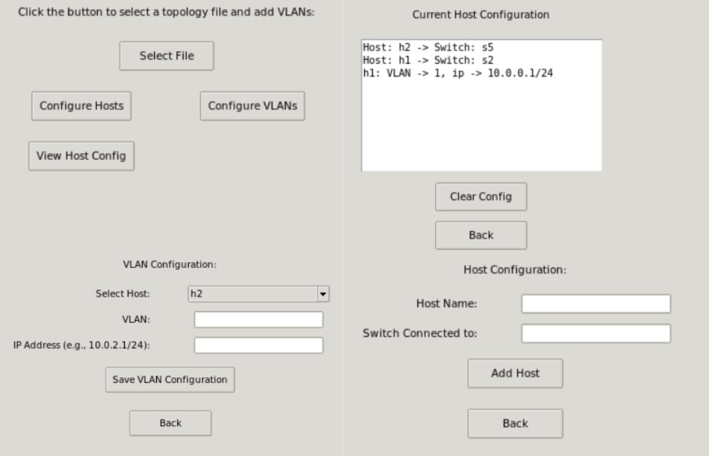

# GML to Topology Converter

This repository provides tools to convert a dataset of GML files describing internet topologies from around the world into ready-to-use Mininet topologies for the ComNetSemu environment. The original dataset is available in the following GitHub repository: [3D Internet Zoo](https://github.com/afourmy/3D-internet-zoo).

## Files Overview

This repository includes the following key Python scripts:

- **`GMLtoTopology.py`**:  
  This script processes GML files, converting them into Mininet topology scripts.

- **`Converter.py`**:  
  Provides a simple terminal-based menu for operations such as:
  - Converting a specific GML file.
  - Converting a random GML file.
  - Converting the entire dataset.
  - Clearing the topology folder.
  
  Each operation asks the user if they want to apply a basic link configuration.

- **`GUIConverter.py`**:  
  Extends `Converter.py` with a GUI, allowing users to:
  - Create custom link configurations via an interactive menu.
  - Delete previous configurations.  
  These configurations are randomly assigned to links within the topology.  
  For link parameter documentation, refer to this link: [TCIntf Documentation](https://mininet.org/api/classmininet_1_1link_1_1TCIntf.html).
  
  

- **`VlanConfig.py`**:  
  Applies host and VLAN configurations specified in `HostConfig.json` and `VLanConfig.json` to a specific converted topology.

- **`GUIVlanConfig.py`**:  
  A more advanced version of `VlanConfig.py`, allowing users to:
  - Add hosts to the network via a GUI.
  - Assign each host to a VLAN.  
  This script helps prevent manual misconfigurations in the `.json` files.
  
  

## How to Demo

### Dependencies:
- `networkx`
- `black` (for correct code formatting)

### Running the GUI Converter:
```bash
sudo python3 GUIConverter.py
```

```bash
sudo python3 GUIVlanConfig.py
```

```bash
sudo mn --custom <topologyname>.py --topo <topologyname> --link tc
```
_Note: --link tc is mandatory to ensure correct link configuration._

### Implementation Notes
The dataset provided by the Internet Zoo Topologies is a heterogeneous collection from various organizations, each with its own way of defining topologies. 
The first issue I addressed was to define each GML file as a multigraph (by adding the header multigraph 1). This was necessary because many files contained duplicate edges between the same nodes which NetworkX does not support in standard graphs.
The main issue with having files from different organizations is that each one defines link configurations differently, and often this information is either incomplete or entirely missing. For this reason i decided to provide the option to define custom link configurations through a GUI, which are then randomly assigned to each link in the network.

For VLAN configuration, I provided an option to define hosts in the network, even if they are not part of a VLAN. This was necessary because the dataset doesn’t distinguish between switches and hosts, and most nodes in the GML files refer to central switches of organizations each with potentially thousands of hosts.
The user can assign each host to a VLAN based on the example from the official Mininet repository: [VlanHost Mininet]](https://github.com/mininet/mininet/blob/master/examples/vlanhost.py).

