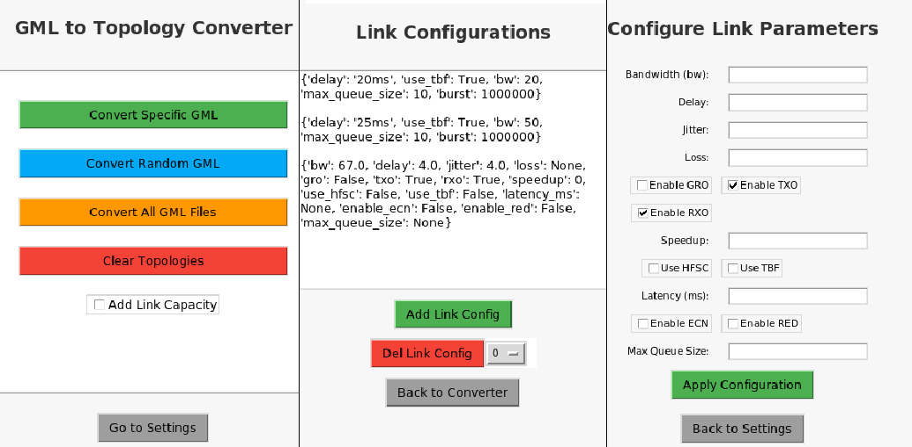

# GML to Topology Converter

This repository provides tools to convert a dataset of GML files describing internet topologies from around the world into ready-to-use Mininet topologies for the ComNetSemu environment. The original dataset is available in the following GitHub repository: [3D Internet Zoo](https://github.com/afourmy/3D-internet-zoo).

## Files Overview

1. **`GMLtoTopology.py`**  
   This Python script contains a class that processes GML files, converting them into corresponding Mininet topology scripts.

2. **`Converter.py`**  
   This Python script provides a simple menu interface, allowing basic operations from the terminal, such as:
   - Convert a specific GML file.
   - Convert a random GML file.
   - Convert the entire dataset.
   - Clear the topology folder.
   
   Each operation asks the user if they want to apply a basic link configuration.

3. **`GUIConverter.py`**  
   This Python script extends the functionality of `Converter.py` by offering a GUI. In addition to the basic operations, it allows the user to:
   - Create custom link configurations through an interactive menu.
   - Delete previous configurations.
   
   These configurations are randomly assigned to links within the topology.

## Implementation Notes

The dataset provided by the Internet Zoo Topologies is a heterogeneous collection from various organizations, each with its own way of defining topologies. 
The first issue I addressed was to define each GML file as a multigraph (by adding the header `multigraph 1`). This was necessary because many files contained duplicate edges between the same nodes which NetworkX does not support in standard graphs.
The main issue with having files from different organizations is that each one defines link configurations differently, and often this information is either incomplete or entirely missing. For this reason i decided to provide the option to define custom link configurations through a GUI, which are then randomly assigned to each link in the network.
