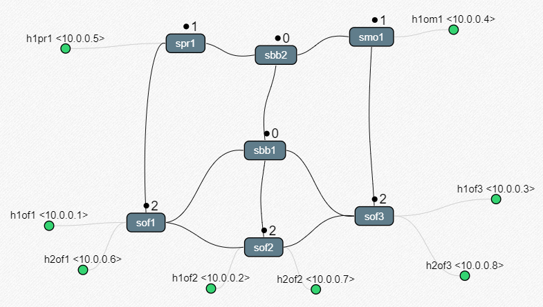
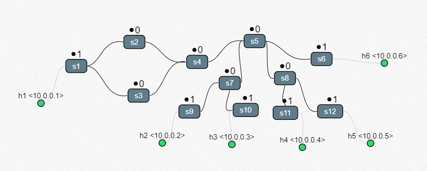
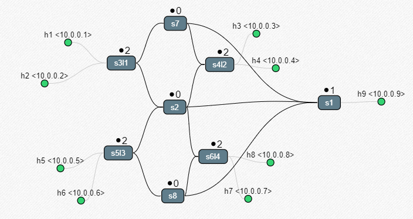

# 🖧 Network Topologies Overview

This document provides a description of the proposed network topologies in this folder. Each topology is available in **four configurations**:
- **Simple**: No VLAN or link capacity settings.
- **VLAN Only**: VLAN configurations without link capacity adjustments.
- **Link Capacity Only**: Link capacity settings without VLAN configurations.
- **Complete**: Combines both VLAN and link capacity settings.

---

## Office Topology

This topology simulates a typical office setup, comprising:
- **Three offices**
- **One printer room**
- **One director's room**

Each room is assigned to a **dedicated VLAN**, and the design ensures **high redundancy** to allow for multiple tests and traffic division across different paths.

### VLAN Assignments:
- **Office 1** = `VLAN 1`
- **Office 2** = `VLAN 2`
- **Office 3** = `VLAN 3`
- **Management** = `VLAN 4`
- **Printer Room** = `VLAN 5`

---

## Hybrid Topology

This topology combines **three different network structures**:
- A **tree topology**
- A **linear topology**
- A **rectangular topology**

It allows testing of multiple network designs within a unified environment.

### VLAN Assignments:
- **Hosts h1, h3** = `VLAN 1`
- **Hosts h2, h4** = `VLAN 2`
- **Hosts h5, h6** = `VLAN 3`

---

## Lab Topology

This topology emulates a laboratory environment, consisting of **four separate labs** connected to a **central switch (s2)**. Additionally, each lab has a **backup switch (s7, s8)**, which will activate in case of a main switch failure. The backup switches have **lower link capacities** to simulate an environment where traffic prefers the main switch, switching to backup only in case of failure.

### VLAN Assignments:
- **Lab 1** = `VLAN 1`
- **Lab 2** = `VLAN 2`
- **Lab 3** = `VLAN 3`
- **Lab 4** = `VLAN 4`

---

